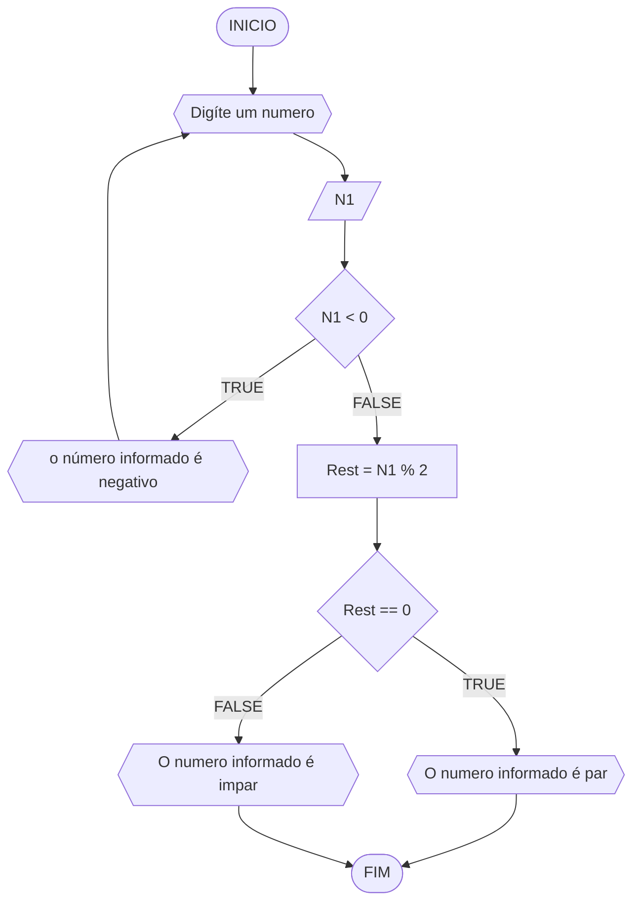
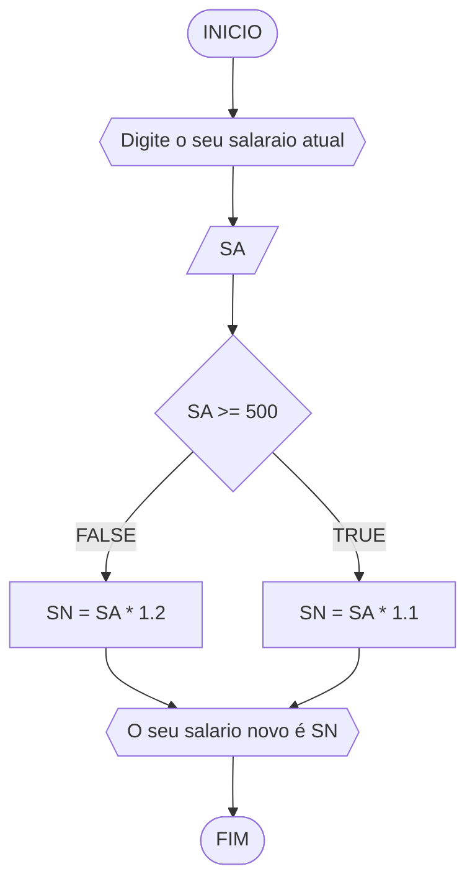
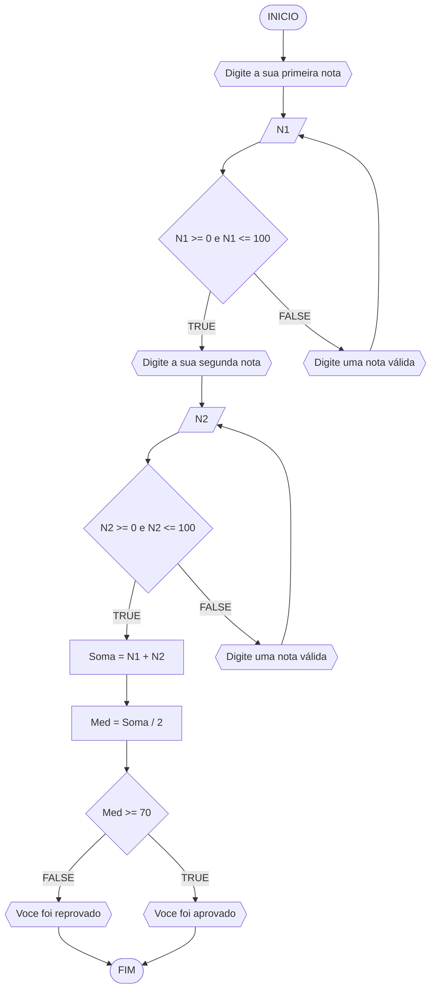
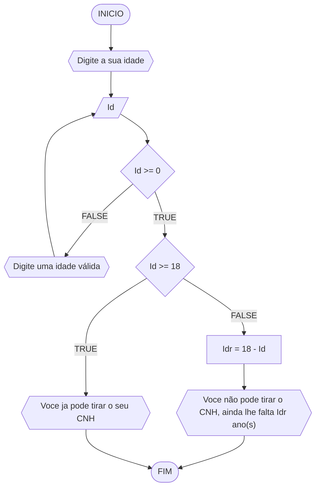

# UNIFOR
**Nome**: Saulo Passos Magalhães 2410605 <br>
**Disciplina**: Raciocinio lógico e Algorítimo

## Lista de exercícios 01

### Exercício 01 (1 ponto)
Represente, em fluxograma e pseudocódigo, um algoritmo para determinar se um número inteiro e positivo é par ou impar.

#### Fluxograma (0,25 ponto)


#### Pseudocódigo (0,5 ponto)
```
ALGORÍTIMO par_ou_impar
DECLARE N1, Rest: Int
INICIO
           // Declare a variavel N1 como dado de entrada
         ESCREVA "Digite um número"
 LEIA N1
 ENQUANTO N1 < 0 FAÇA          // sempre que n1 for menor que 0 entrara num loop para trocar a variavel
	ESCREVA "O número informado é negativo"
FIM_ENQUANTO
Rest = N1 % 2         // comando para determinar a divisão da variavel n1 por 2 
SE Rest == 0         // sempre que a divisao der resto 0 o numero sera considerado par!
	ESCREVA "O número informado é par"
SENÃO 
	ESCREVA "O número informado é impar"
FIM_SE
FIM_ALGORITIMO
```

#### Teste de mesa (0,25 ponto)
|N1|N1 < 0|Rest = N1 % 2|Rest == 0|Saída|
|--|--|--|--|--|
|3|F|1|F|O número informado é impar
|10|F|0|T|O número informado é par
|-1|V|-|-|O número informado é negativo
## Exercício 02 (3 pontos)
Represente, em fluxograma e pseudocódigo, um algoritmo para calcular o novo salário de um funcionário. 
Sabe-se que os funcionários que recebem atualmente salário de até R$ 500 terão aumento de 20%; os demais terão aumento de 10%.

#### Fluxograma (1.0 ponto)

#### Pseudocódigo (1.0 ponto)

```
ALGORITIMO novo_salário
DECLARE SA, SN: Int
INICIO             // declarando incialmente o salario atual de cada funcionario, sendo inteiros
ESCREVA "Digite o seu salário atual"
LEIA SA
SE SA >= 500       // se o salario for maior ou igual a 500, sera multiplicado por 1.1
	SN = SA * 1.1
SENÃO
	SN = SA * 1.2
FIM_SE
ESCREVA "O seu salário novo é", SN        // assim terminando o algoritmo dado por SN
FIM_ALGORÍTIMO
```

#### Teste de mesa (1.0 ponto)

|SA|SA >= 500|SN|SAÍDA|
|--|--|--|--|
|470|F|564|O seu salário novo é 564|
|550|V|605|O seu salário novo é 605|

## Exercício 03 (3 pontos)
Represente, em fluxograma e pseudocódigo, um algoritmo para calcular a média aritmética entre duas notas de um aluno e mostrar sua situação, que pode ser aprovado ou reprovado.

#### Fluxograma (1 ponto)



#### Pseudocódigo (1 ponto)

```
Algoritmo ContaAprovacoes
DECLARE N1, N2, Med: Int
INICIO         // iniciando o algoritmo declarando as variaveis n1 e n2 
ESCREVA "Digite a sua primeira nota"
LEIA N1
ENQUANTO N1 < 0 e N1 > 100 FAÇA     // a variavel deve ser maior que 0 e menor que 100 para ser validada
	ESCREVA "Digite uma nota válida"
	LEIA N1      
FIM_ENQUANTO
ESCREVA "Digite a sua segunda nota"
LEIA N2 
ENQUANTO N2 < 0 e N2 > 100 FAÇA     // a nota deve ser maior que 0 e menor que 100 para ser validada
	ESCREVA "Digite uma nota válida"
	LEIA N2
FIM_ENQUANTO
Med = (N1 + N2)/2     // tendo a soma das variaveis divida por 2 para dar a valor da media 
SE Med >= 70       // se a media obtida for maior ou igual a 70 ira validar como verdadeiro, assim passando para proxima etapa 
	ESCREVA "Voce foi aprovado"
SENÃO
	ESCREVA "Voce foi reprovado"
FIM_SE
FIM_ALGORITIMO 
```

#### Teste de mesa (1 ponto)

|N1|N1 < 0 e N1 > 100|N2|N2 < 0 e N2 > 100|Med = (N1 + N2)/2|Med >= 70|Saída|
|--|--|--|--|--|--|--|
|100|F|60|F|80|V|Voce foi aprovado|
|60|F|70|F|65|F|Voce foi reprovado|
|-70|V|-|-|-|-|Digite uma nota válida|
|50|F|150|V|-|-|Digite uma nota válida|
## Exercício 04 (3 pontos)
Represente, em fluxograma e pseudocódigo, um algoritmo que, a partir da idade do candidato(a), determinar se pode ou não tirar a CNH. 
Caso não atender a restrição de idade, calcular quantos anos faltam para o candidato estar apto.

#### Fluxograma (1.0 ponto)




#### Pseudocódigo (1.0 ponto)

```
Algoritmo ContaAprovacoes
DECLARE Id, Idr: Int      // iniciando o algoritmo declarando a idade atual da pessoa
INICIO
ESCREVA "Digite a sua idade"
LEIA Id
ENQUANTO Id < 0 FAÇA        // enquanto o usuario não digitar uma idade maior doq 0 o algoritmo nao ira reconhecer 
	ESCREVA "Digite uma idade valida"
	LEIA Id
FIM_ENQUANTO
SE Id >= 18          // a idade inserida deve ser maior que 18, se nao sera incapaz de iniciar o processo da CNH
	ESCREVA "Voce ja pode tirar o seu CNH"
SENÃO
	Idr = 18 - Id       // idade restante sera obtida pela a idade valida subtraida pela idade declarada no sistema 
	ESCREVA "Voce não pode tirar o CNH, ainda lhe falta", Idr, "ano(s)"      // escrevendo o tempo restante que falta para poder 
                                                                                    iniciar o processo da CNH
FIM_SE
FIM_ALGORITMO
```

#### Teste de mesa (1.0 ponto)

|Id|Id < 0|Id >= 18|Idr = 18 - Id|Saída| 
|--|--|--|--|--| 
|17|F|F|1|Voce não pode tirar o CNH, ainda lhe falta 1 ano(s)|
|-15|V|-|-|Digite uma idade valida|
|19|F|V|-|Voce ja pode tirar o seu CNH
