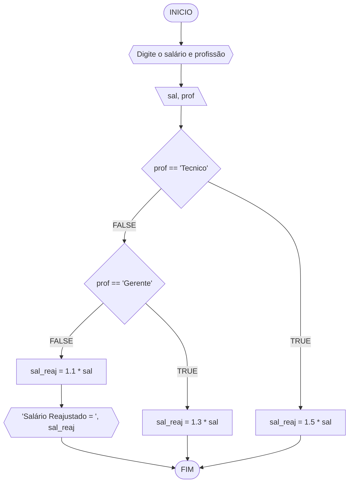

# UNIFOR
**Disciplina: raciocínio logico algorítmico**
**Orientador:** Prof. Ricardo Carubbi
## Lista de exercícios 
### Exercício 03
Represente em Fluxograma ou Pseudocódigo, um algoritmo para determinar se um numero inteiro e positivo é par ou impar.
#### Fluxograma

#### Pseudocodigo
```
1 ALGORITMO verifica_par_impar
2 DECLARE numero, resto NUMERICO
3 ESCREVA "Digite um numero"
4 LEIA numero
5 SE numero > 0 ENTAO 
6    resto = numero % 2
7    SE resto == 0 ENTAO 
8        ESCREVA "O numero e par!"
9    SENAO 
10        ESCREVA "O numero é impar!"
11  SE NAO 
12      ESCREVA "O numero deve ser positivo!"
13 FIM_ALGORITMO
```


# TESTE DE MESA 
#### Teste
#### EXERCICIO 01
| numero | numero > 0 | resto | resto == 0 | Saída |
| -- | -- | -- | -- | -- | 
| -1 | F |   |   | "O número deve ser postivo!" |
| 2 | V | 0 | V | "O número é par!" |
| 3 | V | 1 | F | "O número é impar!" |
| 8 | V | 0 | V | "O número é par!" |
| 9 | V | 1 | F | "O número é ímpar!" |

#### EXERCICIO 02 
| número  |  número = n*3 | 


#### Fluxograma


#### Pseudocódigo
```
1  ALGORITMO calReajuste
2  DECLARE  sal, sal_reaj: real, prof: caractere
3  INICIO
4  LEIA sal, prof
5  ESCOLHA
6   CASO prof == “Técnico”		// caso 1
7     sal_reaj ← 1.5 * sal
8   CASO prof = “Gerente”		// caso 2
9     sal_reaj ← 1.3 * sal
10  SENÃO
11    sal_reaj ← 1.1 * sal
12 FIM_ESCOLHA
13 ESCREVA “Salário Reajustado = “, sal_reaj
14 FIM
```

#### Teste
| sal | prof | prof == “Técnico” | prof = “Gerente” | sal_reaj | Saída |
| -- | -- | -- | -- | -- | -- |
| 1000 | Técnico | V | F | 1500 | “Salário Reajustado = 1500“ |
| 2000 | Gerente | F | V | 2600 | “Salário Reajustado = 2600“ |
| 9000 | Diretor | F | F | 9900 | “Salário Reajustado = 9900“ |

